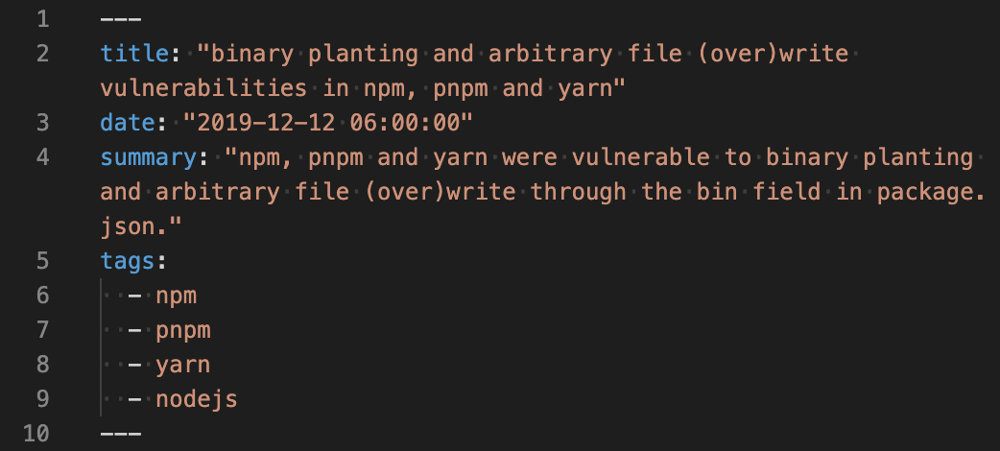

These were my steps to migrate from Gatsby to Hugo in a few steps:
* Go to https://themes.gohugo.io/ and GitHub and search for some minimal blog theme  

* Pick [kiss](https://themes.gohugo.io/kiss/) as it is similar to my Gatsby theme
* Copy the content from the old blog  
old content:  
  
new content:  

* Add a `raw-html` shortcode, because Hugo removes raw HTML in markdown files by default  

* Apply the `raw-html` shortcode  

* Rename `keywords` to `tags` in the frontmatter (because I use them as taxonomy now)
* Change the frontmatter dates as Golang needs a specific format and Hugo works with this by default (`2019-12-12T06:00` => `2019-12-12 06:00:00`)  
old frontmatter:  
  
new frontmatter:  

* Throw out all the CSS and unneeded things and use my own
* Rename the theme (it is completely different now and I may want to reuse it in the future, so it is some sort of fork with improvements at the moment)
* Add the static assets including fonts and CSS from the old Gatsby based blog
* Test locally with `hugo server -D`
* Setup workbox (copy setup from my main domain which was generated with the [workbox wizard](https://developers.google.com/web/tools/workbox/guides/generate-service-worker/cli))
* Setup automatic deployment on GitHub using GitHub Actions ([peaceiris/actions-hugo](https://github.com/peaceiris/actions-hugo) and workbox for building the static files and [SamKirkland/FTP-Deploy-Action](https://github.com/SamKirkland/FTP-Deploy-Action) for the actual deployment)
